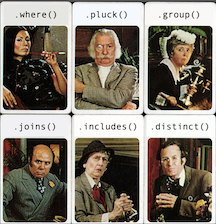

# Rails::Clue

Learn about different ActiveRecord query methods by playing a game of Clue. It's you against the database!

## Setup

1. Clone this repo! You can also fork it and then clone it if you want, I'm not the boss of you!
2. Run `bundle install`. This might take a few minutes. Don't be alarmed if it seems to get stuck on nokogiri... it'll move. Eventually.
3. Run `rails db:setup` in your terminal, from this directory. If things get screwy at this point, you may have to go through the setup steps manually:
```
rails db:drop # gotta get rid of whatever half-baked database you might have created already
rails db:create
rails db:migrate
rails db:seed
```
4. Run `rails console` or `rails c` (they do the same thing, just one has fewer letters to type) in your terminal to start up the Rails console.
5. Follow along with the live demonstration! Or, if I'm not currently talking at you, feel free to putz around on your own. There are some vague instructions below.
6. If you got stuck on any of these steps and discovered a fix/workaround/magical incantation, feel free to submit a pull request to update these steps!
7. I love you!

## How to Play

Most likely, you're setting this up in combination with a talk I'm giving _right now_. If not, I can give you a little guidance! After creating and seeding the database, you'll have Characters, Rooms, and Weapons. The "game" itself takes place entirely in the Rails console. You can look at the model files to get a feel for the relationships, but here's some pertinent info:

Models:

Character
- has one Weapon
- has one Envelope (explained later, read on)
- have Rooms through GuestbookEntries (GuestbookEntries are a join table between Characters and Rooms)
- You can call `.is_murderer?` on any Character to see if they're the murderer. This is a method I've written on the Character model, so don't use it until you're ready to check!

Weapon
- belongs to a Character
- You can call `is_murder_weapon?` on any Weapon. Again, don't use this until you're ready to check!

Room / GuestbookEntries
- GuestbookEntries are a join table between Characters and Rooms (Characters have Rooms through GuestbookEntries)
- GuestbookEntries represent logs for when a given character entered and exited a given Room.
- You guessed it, you can call `is_scene_of_the_crime?` on any Room!
- GuestbookEntry attributes: `time_entered`, `time_exited`

Envelope
- The database will also have one Envelope. That one Envelope contains the murderer, weapon, and location, so don't look at it until you're done playing and just want to be sure you're right!
- You can run `Envelope.take.whodunnit` to see who, in fact, dunnit. Probably don't use this until the very, very end when you're just checking to see if your guess is correct!
- Envelope attributes: `murder_start_time`, `murder_end_time`
- You _can_ use the attributes above to help deduce whodunnit, based on Characters' GuestbookEntry enter/exit times. Just be careful not to accidentally expose yourself to the Envelope's relationships! I recommend accessing these attributes directly (i.e. `Envelope.take.murder_start_time`)

More info / tips:
- Use a variety of Active Record queries to deduce the murderer, weapon, and location! There aren't really any hard and fast rules. If you come up with a particularly interesting chain of query methods, see if you can optimize it further and bring down the query time! Be creative! Don't cheat!
- The combinations of Characters, Rooms, Weapons, and who is in the Envelope are all random, so if you want a fresh start, feel free to reset the database and start over!
- See below for reference information.

## Reference

You may appreciate having access to the [ActiveRecord documentation](https://guides.rubyonrails.org/active_record_querying.html) if you want to fool around in the database on your own! Feel free to fork this repo and change the seed data to your liking if you so desire! The world (or, this database anyway) is your oyster!
